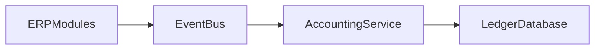

# Accounting Posting Engine

This component converts **business events into journal entries**.

It ensures:

- double-entry accounting
- consistent financial records
- automation of accounting rules

---

# Core Concept

ERP modules emit **events**.

Example:

````

InvoiceCreated
BillApproved
PaymentReceived

````

The accounting engine maps these events to **accounting rules**.

---

# Architecture

```mermaid
flowchart LR

Event --> AccountingRuleEngine
AccountingRuleEngine --> JournalBuilder
JournalBuilder --> DoubleEntryValidator
DoubleEntryValidator --> LedgerWriter
LedgerWriter --> MongoDB
````

---

# Example Rule

Event:

```
InvoiceCreated
```

Rule:

```
DR Accounts Receivable
CR Revenue
CR VAT Payable
```

Stored rule document:

```json
{
  "event": "invoice.created",
  "entries": [
    { "account": "accounts_receivable", "type": "debit", "source": "invoice.total" },
    { "account": "revenue", "type": "credit", "source": "invoice.subtotal" },
    { "account": "vat_payable", "type": "credit", "source": "invoice.vat_amount" }
  ]
}
```

---

# Journal Creation Algorithm

Steps:

1. receive business event
2. load accounting rule
3. resolve account IDs
4. build journal_lines
5. validate double-entry
6. write journal
7. write journal_lines

---

# Double Entry Validation

Before posting:

```
sum(debit) == sum(credit)
```

If invalid:

```
reject journal
```

---

# Immutability Rule

After posting:

```
journal.status = posted
```

Editing is forbidden.

Instead:

```
create reversal journal
```

---

# Reversal Example

Original entry:

```
DR Expense
CR Accounts Payable
```

Reversal entry:

```
DR Accounts Payable
CR Expense
```

---

# Enterprise Scalability

To support millions of transactions:

1. asynchronous posting queue
2. event streaming
3. ledger write batching

Future architecture:



---

# Integration with ERP Modules

Future integrations:

Sales module
Procurement module
Payroll module
Inventory module

All generate **accounting events**.
