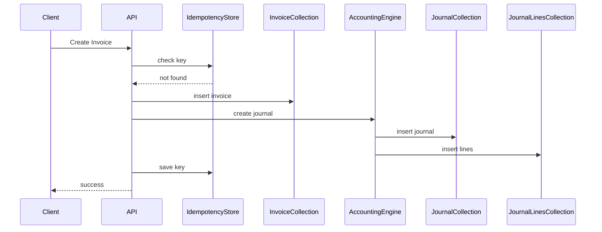

# Financial Transaction Consistency Model

Financial systems must guarantee:

- idempotency
- atomic posting
- audit traceability

This document describes the consistency model used by the ERP finance module.

---

# Problem

If APIs retry requests:

````

Create Invoice

```

The system might accidentally create:

```

2 invoices
2 journal entries

```

This corrupts financial records.

---

# Solution: Idempotent Financial APIs

Every financial write request must include:

```

idempotency_key

```

Example request:

```

POST /invoices

```

Header:

```

Idempotency-Key: 9a2f8b1c

````

---

# Idempotency Collection

```json
{
  "_id": "9a2f8b1c",
  "endpoint": "/invoices",
  "response_hash": "...",
  "created_at": "2026-03-01"
}
````

If the same key appears again:

```
return previous response
```

---

# Transaction Workflow



---

# Atomic Posting Strategy

MongoDB transaction:

```
start_transaction

insert invoice
insert journal
insert journal_lines

commit
```

If any step fails:

```
rollback
```

---

# Audit Logging

Every financial write generates an audit log.

Example:

```json
{
  "entity": "invoice",
  "entity_id": "inv_001",
  "action": "create",
  "user_id": "user_01",
  "timestamp": "2026-03-01T10:00:00Z"
}
```

Audit logs are immutable.

---

# Period Locking

Once accounting period is closed:

```
no new journal entries allowed
```

Exception:

```
reversal journals only
```

---

# Future Compliance Extensions

Prepared for:

* e-Faktur submission tracking
* tax audit history
* Indonesian Coretax integration
* financial consolidation across subsidiaries

These will use the same **immutable ledger architecture**.